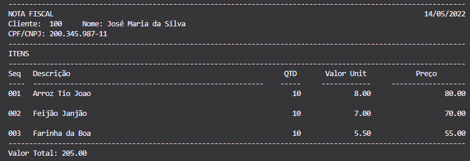

# Atividade Avaliação 5
## Implementar o Método Imprimir Nota Fiscal, seguindo o layout pedido
### Refatorações foram feitas no código original para melhor legibilidade e organização.
### Imagem do Terminal com o Layout Impresso:

